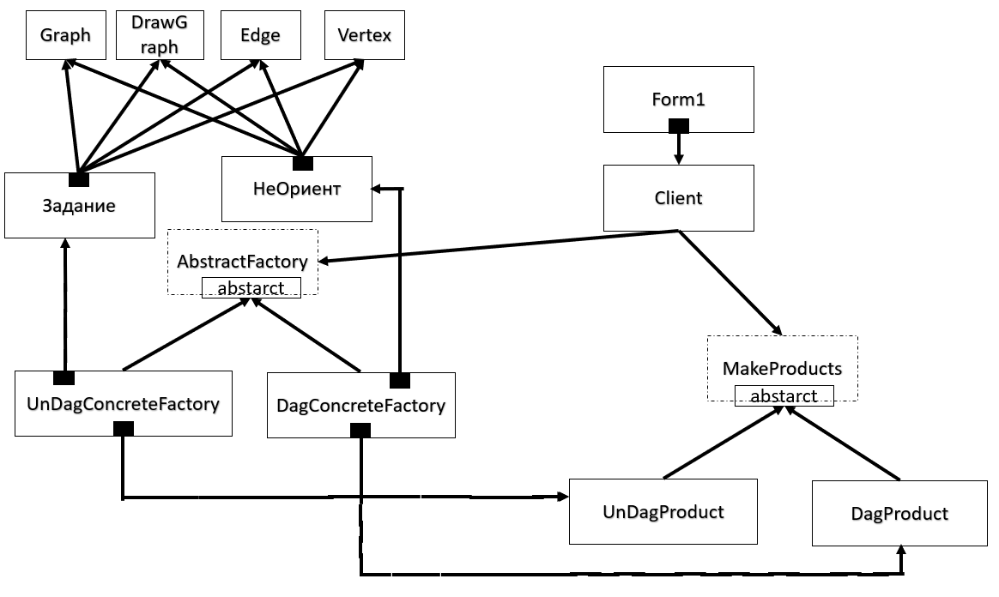

# 📋 Build a Simple Directed Acyclic Graph (или построение простого ациклического ориентированного графа).
## 📖 Постановка задачи и описание алгоритма.
Используя алгоритм _Построения простого ациклического ориентированного графа_, __создать приложение__, которое будет это делать. Использовать __паттерн разработки Abstract Factory__.

## 🖼️ 

